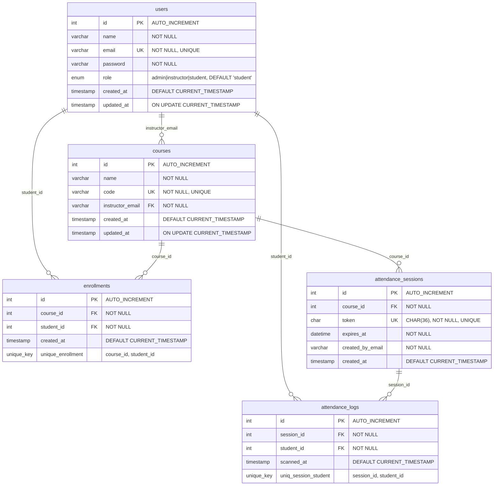
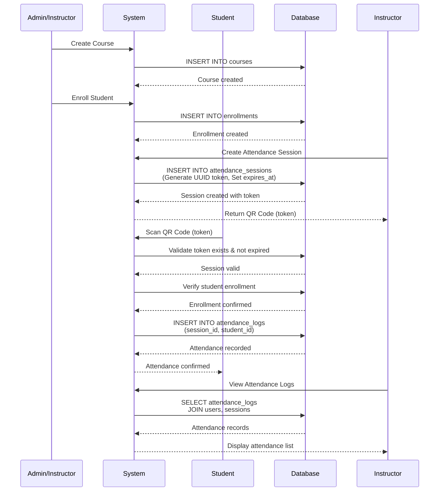

# SAMS Attendance System - Entity Relationship Diagram

## Mermaid ERD



## Business Flow Logic

### 1. User Management Flow
```
Admin/Instructor creates Users → users table
- Users can have roles: admin, instructor, or student
- Each user has unique email
```

### 2. Course Creation Flow
```
Admin/Instructor creates Course → courses table
- Course assigned to Instructor via instructor_email (FK to users.email)
- Course has unique code
- ON DELETE RESTRICT: Cannot delete instructor if courses exist
```

### 3. Enrollment Flow
```
Admin/Instructor enrolls Student → enrollments table
- Links student_id (FK to users.id) with course_id (FK to courses.id)
- Many-to-Many: Student can enroll in multiple courses
- Many-to-Many: Course can have multiple students
- UNIQUE constraint prevents duplicate enrollments
- ON DELETE CASCADE: Enrollment removed if course or student deleted
```

### 4. Attendance Session Creation Flow
```
Instructor/Admin creates Attendance Session → attendance_sessions table
- Session belongs to a course (course_id FK to courses.id)
- Generates unique UUID token (CHAR(36))
- Sets expiration time (typically 15 minutes from creation)
- Stores creator email (created_by_email)
- ON DELETE CASCADE: Sessions removed if course deleted
```

### 5. Attendance Scanning Flow
```
Student scans QR Code → attendance_logs table
- Validates token exists in attendance_sessions
- Checks token hasn't expired (expires_at > NOW())
- Verifies student is enrolled in course (via enrollments table)
- Records attendance: session_id + student_id
- UNIQUE constraint prevents duplicate scans per session
- ON DELETE CASCADE: Logs removed if session or student deleted
```

## Key Constraints & Business Rules

### Foreign Key Relationships
- `courses.instructor_email` → `users.email` (ON UPDATE CASCADE, ON DELETE RESTRICT)
- `enrollments.course_id` → `courses.id` (ON DELETE CASCADE)
- `enrollments.student_id` → `users.id` (ON DELETE CASCADE)
- `attendance_sessions.course_id` → `courses.id` (ON DELETE CASCADE)
- `attendance_logs.session_id` → `attendance_sessions.id` (ON DELETE CASCADE)
- `attendance_logs.student_id` → `users.id` (ON DELETE CASCADE)

### Unique Constraints
- `users.email` - Unique email per user
- `courses.code` - Unique course code
- `attendance_sessions.token` - Unique QR token per session
- `enrollments(course_id, student_id)` - One enrollment per student-course pair
- `attendance_logs(session_id, student_id)` - One attendance record per student per session

### Indexes for Performance
- `users`: idx_email, idx_role
- `courses`: idx_code, idx_instructor
- `enrollments`: idx_course, idx_student
- `attendance_sessions`: idx_attendance_course, idx_attendance_expires
- `attendance_logs`: idx_session, idx_student

## Attendance Workflow Sequence



## Data Flow Summary

1. **Setup Phase**: Admin creates users and courses
2. **Enrollment Phase**: Admin/Instructor enrolls students in courses
3. **Session Creation**: Instructor creates attendance session (generates QR token)
4. **Attendance Recording**: Student scans QR code → System validates → Records attendance
5. **Reporting**: Instructor/Admin views attendance logs per session

